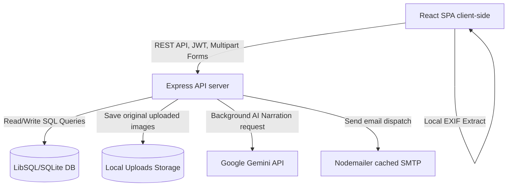
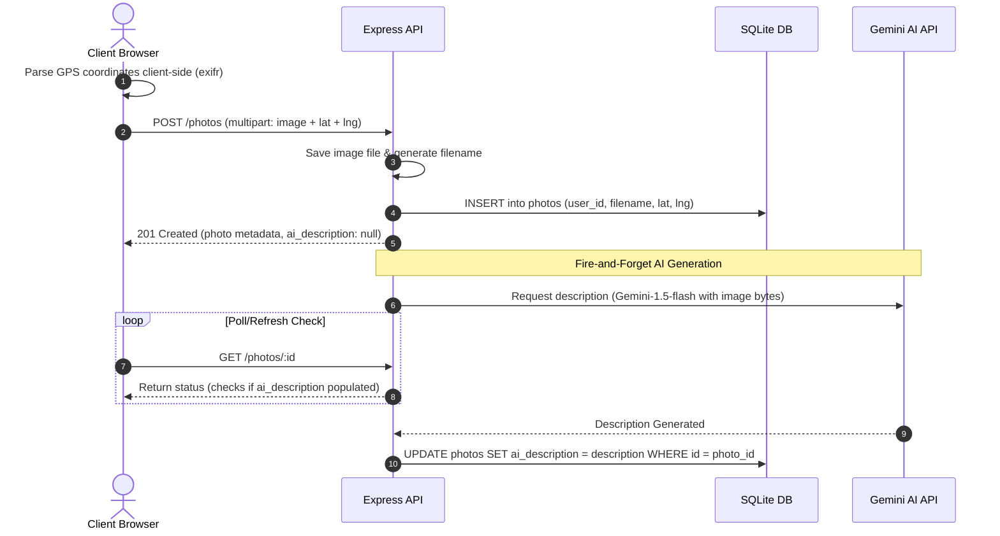
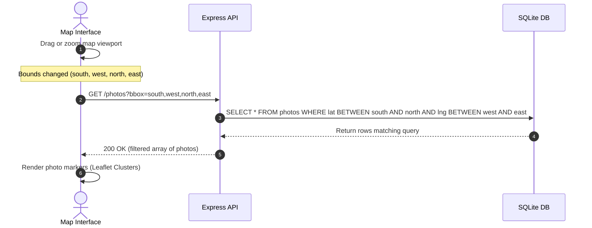

# 🗺️ GeoPhoto — Interactive Geotagged Photo Map

This is a a full-stack web application where users can sign up or log in, upload geotagged photos and insert their GPS coordinations
and explore them on an interactive map. Clicking a photo marker opens a detail panel with the image, an AI-generated(this needs API tokens) description and a comments thread.

---

## Quick Start (Local)

You need **Node.js ≥ 18** installed. I try to do a version using Docker too !

### 1. Backend

```bash
cd backend
cp .env.example .env          # copy env template
# (Optional) add your Gemini API key to .env for AI descriptions
npm install
npm run dev                   # starts on http://localhost:3001
```

### 2. Frontend (new terminal)

```bash
cd frontend
npm install
npm run dev                   # starts on http://localhost:5173
```

Open **http://localhost:5173** in your browser.

---

## Features

Feature

Sign up / Log in (JWT)
Upload geotagged photos
Auto-detect GPS from EXIF
Manual pin placement on mini-map 
Interactive map (dark theme, clustered)
Photo thumbnail markers
Photo detail modal
Comments (per photo)
AI photo description (Gemini)

---

## AI Description Setup

1. I get a free API key from [Google AI Studio](https://aistudio.google.com/app/apikey)
2. Add it to `backend/.env`:
   ```
   #to this exactly code:
   GEMINI_API_KEY=your-key-here
   ```
3. Restart the backend. Descriptions are generated automatically on upload and appear in the photo modal.

### AI Regeneration Notes

- AI narration uses the free Google Gemini API key.
- After running bulk regeneration or heavy usage, pressing **“Regenerate”** in the photo modal may return a quota‑limit error from Gemini.
- The last saved narration is stored in the database and will keep displaying even if regeneration is temporarily blocked.
- Occasionally, Google Gemini returns temporary 503 “high demand” errors; the backend retries automatically, but the Generate button may take a few seconds or fail intermittently.
---

## 📧 Email Verification & SMTP Setup

The application features a secure, token-based verification system for **Signups (Email confirmation)** and **Password Resets**. To make it easy to run and test immediately, the email system works in two modes:

### 1. Developer Fallback Mode (Zero Configuration)
If you do not add email settings to your `.env` file:
* The backend automatically intercepts outbound mail and generates a temporary, sandboxed mailbox on **Ethereal Email**.
* A clickable **Test link** is printed in your terminal and **displayed directly on your screen** in green text.
* Simply click the link in your browser to view the email, read the message, and copy the 8-digit verification code!

### 2. Real Email Mode (Gmail Setup)
To send real verification emails to users' inboxes:
1. Turn **ON** Two-Step Verification in your Google Account settings.
2. Go to **[myaccount.google.com/apppasswords](https://myaccount.google.com/apppasswords)** and generate a new App Password (e.g. name it "GeoPhoto").
3. Copy the 16-character password.
4. Add these variables to your **`backend/.env`** file:
   ```ini
   SMTP_HOST=smtp.gmail.com
   SMTP_PORT=587
   SMTP_USER=your-gmail-address@gmail.com
   SMTP_PASS=your-16-char-app-password
   ```
5. Restart your backend server. Codes will now arrive in real user inboxes!

---

## 📐 System Architecture

The GeoPhoto application is engineered as a highly responsive, decoupled client-server architecture designed to minimize latency and server overhead while handling intensive media assets and geo-coordinates.



---

## 🗄️ Database Schema & Indexing

The data layer utilizes LibSQL (an open-source, serverless-friendly SQLite fork) to store users, photos, and comments. This database provides native speed, acid compliance, and pure-JS portability without compile-time bindings.

```
┌─────────────────────────────────┐           ┌─────────────────────────────────┐
│              users              │           │             photos              │
├─────────────────────────────────┤           ├─────────────────────────────────┤
│ id (PK, AUTOINCREMENT)  [INT]   │◄────┐     │ id (PK, AUTOINCREMENT)  [INT]   │◄───┐
│ email (UNIQUE, INDEXED) [TEXT]  │     └────┼│ user_id (FK, INDEXED)   [INT]   │    │
│ password_hash           [TEXT]  │           │ filename                 [TEXT]  │    │
│ name                    [TEXT]  │           │ original_name            [TEXT]  │    │
│ username (UNIQUE)       [TEXT]  │           │ lat                      [REAL]  │    │
│ created_at              [DATETIME]          │ lng                      [REAL]  │    │
└─────────────────────────────────┘           │ ai_description           [TEXT]  │    │
                                              │ created_at              [DATETIME]    │
                                              └─────────────────────────────────┘    │
                                                                                     │
                                              ┌─────────────────────────────────┐    │
                                              │            comments             │    │
                                              ├─────────────────────────────────┤    │
                                              │ id (PK, AUTOINCREMENT)  [INT]   │    │
                                              │ photo_id (FK, INDEXED)  [INT]   │────┘
                                              │ user_id (FK)            [INT]   │
                                              │ body                     [TEXT]  │
                                              │ created_at              [DATETIME]
                                              └─────────────────────────────────┘
```

### ⚡ Optimization Indexes
To ensure sub-millisecond query execution as the photo count grows:
1. `idx_photos_location ON photos(lat, lng)`: Crucial for rapid bounding-box (`bbox`) viewport filtering.
2. `idx_photos_user ON photos(user_id)`: Speeds up profile views and owner checks.
3. `idx_comments_photo ON comments(photo_id)`: Optimizes retrieval of nested photo discussions.

---

## 🔄 Core Data Flows

### 1. Photo Upload & AI Narration Flow


### 2. Viewport-Based Loading Flow


---

## ⚡ Scaling to 10k+ Photos (Strategist Blueprint)

To maintain a frame rate of **60 FPS** on the map and **<100ms API response times** with 10k+ photos:

1. **Leaflet Marker Clustering:** Directly loading 10,000 DOM elements into Leaflet crashes modern browsers. We use `react-leaflet-cluster` which groups markers based on proximity.
2. **Bounding Box Viewport Queries (`bbox`):** Only fetch and display photos inside the active map bounds. When the user pans, the client requests `GET /photos?bbox=lat_min,lng_min,lat_max,lng_max`.
3. **Database Migration (PostgreSQL + PostGIS):** As spatial dataset sizes grow, SQLite's B-Trees become inefficient. We plan to migrate to PostgreSQL and utilize:
   * **`GEOMETRY(Point, 4326)`** fields.
   * **`GIST (Generalized Search Tree)`** spatial index for 100x faster geographic bounding-box queries.
   * Query syntax: `ST_Contains(ST_MakeEnvelope(west, south, east, north, 4326), geom)`.
4. **Image Processing & CDNs:** 
   * **Sharp Integration:** Resize original uploads on the server into 300px thumbnails (for map popup pins) and 1200px preview images (for the modal).
   * **S3 + CDN Storage:** Offload media delivery from the Node.js process to AWS S3, fronted by a CDN (CloudFront/Cloudflare) caching images aggressively.

---

## 🛡️ Security Architecture

1. **JWT & Silent Session Auto-Renewal:**
   * JWTs are signed with a 7-day expiration.
   * **Auto-Renewal:** Inside the [auth.js](file:///Users/raresolteanu/Desktop/HyLight-Tehnical%20test/geophotos/backend/middleware/auth.js) middleware, if a valid token is found with **< 2 days** of life remaining, a new token is silently signed and sent back in the `X-Refresh-Token` header.
   * Frontend [api.js](file:///Users/raresolteanu/Desktop/HyLight-Tehnical%20test/geophotos/frontend/src/api.js) automatically monitors this header and overwrites local storage, maintaining sessions transparently.
2. **Granular Errors:** Provides clear exception reasons (e.g. `TOKEN_EXPIRED`, `TOKEN_INVALID`) allowing the client-side code to redirect expired sessions without breaking user flows.
3. **Memory-Safe Rate Limiting:**
   * Utilizes an in-memory IP request Map.
   * **Garbage Collector:** Runs every 5 minutes to sweep and delete expired IPs, preventing memory leaks under high traffic.
   * **Test Whitelist:** Loopback addresses (`127.0.0.1`, `::1`) and `NODE_ENV === 'test'` configurations bypass throttling to ensure testing pipelines never trigger rate limits.
4. **Owner-Check Restrictions:**
   * Photo deletions (`DELETE /photos/:id`) and AI regenerations (`POST /photos/:id/regenerate-description`) enforce token-ownership verification.

---

## Project Structure

```
geophotos/
├── backend/
│   ├── .env.example
│   ├── server.js          # Express entry point
│   ├── db.js              # libsql/client setup + query helpers
│   ├── middleware/auth.js # JWT middleware
│   └── routes/
│       ├── auth.js        # POST /auth/signup, /auth/login
│       ├── photos.js      # GET/POST/DELETE /photos
│       └── comments.js    # GET/POST /comments/:photoId
└── frontend/
    ├── index.html
    └── src/
        ├── App.jsx
        ├── index.css       # Full design system
        ├── api.js          # Axios base client
        ├── context/AuthContext.jsx
        └── components/
            ├── Auth/AuthPage.jsx
            ├── Map/MapPage.jsx
            ├── Map/MapView.jsx          # Leaflet + clusters
            ├── Upload/UploadModal.jsx   # EXIF + mini-map + upload
            └── PhotoModal/PhotoModal.jsx # Detail + AI + comments
```

---

## Production Deployment (outline)

Layer | Recommended service |

Frontend | Vercel (free, CDN) |
Backend + DB | Railway / Render (Node.js + persistent disk) |
Image storage | Swap `/uploads` for AWS S3 + presigned URLs |
AI | Gemini API key as env var |

---

## Scaling to 10k Photos

1. **Clustering** — `react-leaflet-cluster` groups markers at low zoom, reducing DOM nodes drastically
2. **Viewport fetching** — use `GET /photos?bbox=lat1,lng1,lat2,lng2` to only load visible photos
3. **Thumbnails** — serve a resized 400px thumbnail for markers, full image on demand (use Sharp or ImageMagick)
4. **CDN** — serve `/uploads` from a CDN (CloudFront) with aggressive cache headers
5. **PostGIS** — migrate from SQLite to PostgreSQL + PostGIS for true spatial queries at scale

---

## 📅 Project Implementation Time Estimation

To deliver a fully tested, secure and scalable version of this application in a real production environment, we estimate the following workload:

### Phase 1: Setup & Database Schema (2 hours)
* Initialize workspace structures, package configurations and database tables.
* Configure environment profiles and indexing bounds.

### Phase 2: Backend REST APIs (8 hours)
* Develop routes for user registration, login, photo uploads and comments.
* Integrate Multer image parsing, Sharp resizing and static routing directories.

### Phase 3: Authentication & Security Controls (6 hours)
* Write password hashing algorithms, JWT validation logic and the silent token renewal middleware.
* Establish in-memory rate-limiter maps and clean-up intervals.

### Phase 4: Frontend Development & CSS Design (10 hours)
* Build the core authentication page tabs, upload forms and details viewport.
* Code the custom responsive CSS design system including glassmorphic effects.

### Phase 5: Map Integration & Clustering (6 hours)
* Build Leaflet markers, map controls and dynamic coordinate selectors.
* Connect cluster groupings and moveend viewport search bounds.

### Phase 6: AI Features & Accessibility (4 hours)
* Integrate the Google Gemini Vision API handler.
* Develop the browser text-to-speech audio reader.

### Phase 7: Testing & CI pipelines (6 hours)
* Set up Vitest, MSW api interceptors and mock setup engines.
* Code 13 unit tests for authorization tabs, file uploads and details popups.

### Phase 8: Cloud Deployment (3 hours)
* Build Docker assets and link persistent Render volumes.
* Deploy web CDNs and configure domain records.

**Total Project Estimate**: 45 Hours
