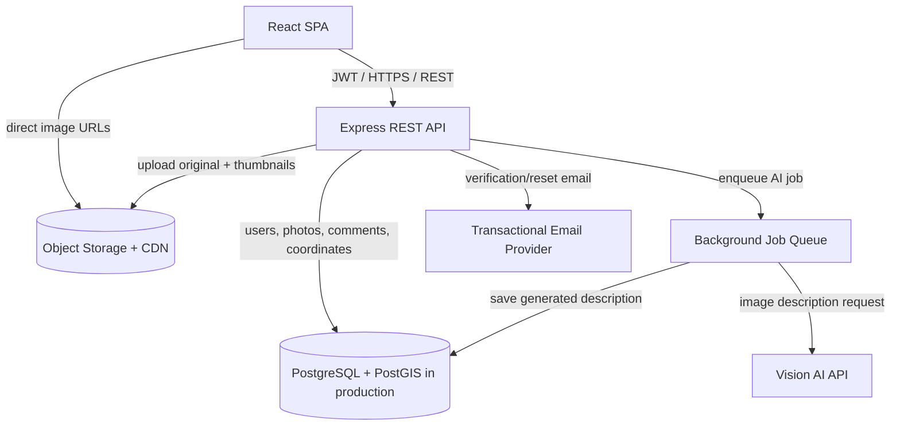

# Production Strategy

This document answers the planning questions from the HyLight fullstack technical test. It describes how I would build GeoPhoto as a clean, scalable, production-ready application before writing production code.

## 1. Technology Choices

### Frontend

I would use React with Vite and TypeScript. React is a strong fit because the UI has several stateful workflows: authentication, upload, map filtering, selected photo details, comments, and AI generation status. Vite keeps local development fast and the build simple.

For maps, I would use Leaflet with React Leaflet for the first version. It is open-source, easy to integrate, and works well for custom photo markers. For more advanced large-scale visualization, I would consider MapLibre GL because it handles vector tiles and canvas/WebGL rendering more efficiently than DOM markers.

### Backend

I would use Node.js with Express for the API. It is simple, productive, and well suited for multipart uploads, authentication, and REST endpoints. For a larger team or stricter contracts, I would add OpenAPI documentation and request validation with Zod.

### Database

For the technical-test version, SQLite/libSQL is enough: it is easy to run locally and avoids setup friction. For production, I would use PostgreSQL with PostGIS. PostGIS gives proper geospatial indexing, bounding-box queries, radius queries, and future support for analytics by area.

### Storage

For the local version, files can be stored in a backend `uploads/` folder. For production, I would use object storage such as AWS S3, Google Cloud Storage, or Cloudflare R2, with a CDN in front. Images should not be served from the Node process in production.

### Authentication

For this project I would use email/password authentication with bcrypt password hashing and JWT access tokens. For production, I would store refresh tokens securely, rotate them, and prefer HttpOnly cookies over local storage to reduce token exposure from XSS. Email verification and password reset codes should expire quickly and be single-use.

### AI

I would use a multimodal model such as Gemini or OpenAI vision models to generate short image descriptions. AI should be asynchronous: upload should not block on AI. The API can create the photo immediately, enqueue description generation, and update the row when the result is ready.

## 2. System Architecture

### Main API Endpoints

- `POST /auth/send-signup-code`
- `POST /auth/signup`
- `POST /auth/login`
- `POST /auth/send-reset-code`
- `POST /auth/reset-password`
- `GET /photos`
- `GET /photos?bbox=south,west,north,east`
- `GET /photos/:id`
- `POST /photos`
- `DELETE /photos/:id`
- `POST /photos/:id/regenerate-description`
- `GET /comments/:photoId`
- `POST /comments/:photoId`

### Database Models

`users`

- `id`
- `email`
- `password_hash`
- `name`
- `username`
- `created_at`

`photos`

- `id`
- `user_id`
- `filename` or production `storage_key`
- `original_name`
- `lat`
- `lng`
- production `geom GEOGRAPHY(Point, 4326)`
- `ai_description`
- `created_at`

`comments`

- `id`
- `photo_id`
- `user_id`
- `body`
- `created_at`

Important indexes:

- `users(email)` unique
- `photos(user_id)`
- `photos(lat, lng)` for the local SQLite version
- `photos USING GIST(geom)` for the production PostGIS version
- `comments(photo_id, created_at)`

## 3. Authentication Flow

1. User enters email and password.
2. Backend generates a single-use 8-digit verification code with a 10-minute expiry.
3. Backend sends the code by email.
4. User submits the code.
5. Backend validates the code, hashes the password with bcrypt, creates the user, and returns a JWT.
6. Protected requests send `Authorization: Bearer <token>`.
7. Backend validates the JWT before allowing uploads, comments, deletes, or profile actions.

In production I would move JWT handling to secure HttpOnly cookies with refresh token rotation. That is safer than local storage for long-lived sessions.

## 4. Image Upload To Map Display Flow

1. User selects or drags a photo into the upload modal.
2. The browser tries to extract GPS metadata using EXIF parsing.
3. If GPS exists, latitude and longitude fields are filled automatically.
4. If GPS is missing, the user can click a mini-map, type coordinates manually, or optionally request AI location estimation.
5. The frontend submits a multipart request to `POST /photos` with the image and coordinates.
6. The backend authenticates the user, validates the file type and coordinates, stores the image, normalizes orientation with Sharp, and inserts a photo row.
7. The backend starts AI description generation asynchronously if an API key is configured.
8. The map fetches photos through `GET /photos` or `GET /photos?bbox=...`.
9. Markers are clustered on the map.
10. Clicking a marker opens the photo modal, which loads the image, metadata, AI description, and comments.

## 5. Deployment Plan

### Local

- Frontend: Vite dev server on port `5173`
- Backend: Express server on port `3001`
- Database: local SQLite/libSQL file
- Storage: local `backend/uploads`

### Production

- Frontend: Vercel, Netlify, or Cloudflare Pages
- Backend: Render, Railway, Fly.io, or AWS ECS
- Database: managed PostgreSQL with PostGIS
- Storage: S3, Cloudflare R2, or Google Cloud Storage
- CDN: CloudFront or Cloudflare
- Secrets: platform environment variables
- Monitoring: structured logs, uptime checks, API error tracking
- CI/CD: run tests and build on every pull request before deployment

## 6. Image Storage Trade-Offs

### Local Disk

Pros:

- Very fast to implement
- Good for demos and local development
- No external dependency

Cons:

- Not reliable on ephemeral hosting
- Hard to scale across multiple backend instances
- No CDN caching by default
- Backups are manual

### Database Blob Storage

Pros:

- Strong transactional consistency with metadata
- Simpler backup story for very small datasets

Cons:

- Database grows quickly
- Slower and more expensive for media delivery
- Not ideal for CDN caching
- Makes migrations and backups heavier

### Object Storage

Pros:

- Best production option for images
- Cheap, durable, and scalable
- Works naturally with CDN caching
- Supports direct uploads with presigned URLs
- Allows separate original, preview, and thumbnail variants

Cons:

- More setup
- Requires storage lifecycle rules and access policy design
- Metadata consistency must be handled carefully

My production choice would be object storage with these variants:

- Original image for audit/download
- 1200px preview for modal display
- 300px thumbnail for map/sidebar markers

The database stores metadata and storage keys, not image bytes.

## 7. Keeping The Map Performant With 10k Photos

Rendering 10k full DOM markers at once is inefficient. I would combine several techniques:

1. Viewport queries: request only photos inside the current map bounds with `bbox`.
2. Marker clustering: group nearby markers at low zoom levels.
3. Thumbnail URLs: markers use small thumbnails, not original images.
4. Pagination or result caps: for very dense areas, return clusters or capped results until the user zooms in.
5. Spatial indexes: use PostGIS `GIST` indexes for fast bounding-box queries.
6. Debounced map movement: fetch only after `moveend`, not on every pan frame.
7. CDN image delivery: avoid sending image traffic through the API server.
8. Optional vector tile strategy: for very large datasets, serve server-side clusters or vector tiles instead of individual points.

With 10k photos, the first production milestone would be viewport fetching plus clustering. For 100k+ photos, I would move clustering to the backend or use map vector tiles.

## 8. Testing Strategy

I would test the application at three levels:

- Unit tests: auth form behavior, upload validation, photo modal comments and AI refresh behavior.
- API tests: signup/login, upload validation, bbox filtering, comment creation, unauthorized access, owner-only delete.
- End-to-end tests: sign up, upload a geotagged image, see marker on map, open modal, add comment.

For production I would also add file upload security tests, rate-limit tests, and smoke tests after deployment.

## 9. Realistic Time Estimate

| Step | Estimate |
| --- | ---: |
| Project setup, repo structure, environment files | 1.5h |
| Database schema and indexes | 1.5h |
| Authentication, email verification, password reset | 5h |
| Photo upload API, file validation, image rotation | 4h |
| Comments API and owner-only delete | 2h |
| AI description integration | 3h |
| React authentication UI | 4h |
| Upload modal with EXIF extraction and manual map pin | 5h |
| Main map, markers, clustering, bbox filtering | 5h |
| Photo detail modal and comments UI | 4h |
| Testing and bug fixing | 5h |
| Production deployment setup | 3h |
| Documentation and demo preparation | 2h |

Total realistic production-quality estimate: about 45 hours.

For a 4-hour technical-test version, I would intentionally reduce scope: simple auth, local storage, SQLite, Leaflet markers, upload, map display, comments, and a clean README. Then I would document the production improvements clearly.

## 10. Current Implementation Versus Production Target

The submitted version is a functional end-to-end implementation using React, Express, SQLite, local image storage, Leaflet clustering, email verification, comments, EXIF extraction, and optional Gemini AI.

The main production upgrades I would make next are:

- Move images to object storage and serve through a CDN.
- Generate thumbnails and previews during upload.
- Replace SQLite with PostgreSQL + PostGIS.
- Use secure cookie-based sessions with refresh token rotation.
- Add backend integration tests and Playwright end-to-end tests.
- Add request validation, structured logging, and deployment monitoring.
